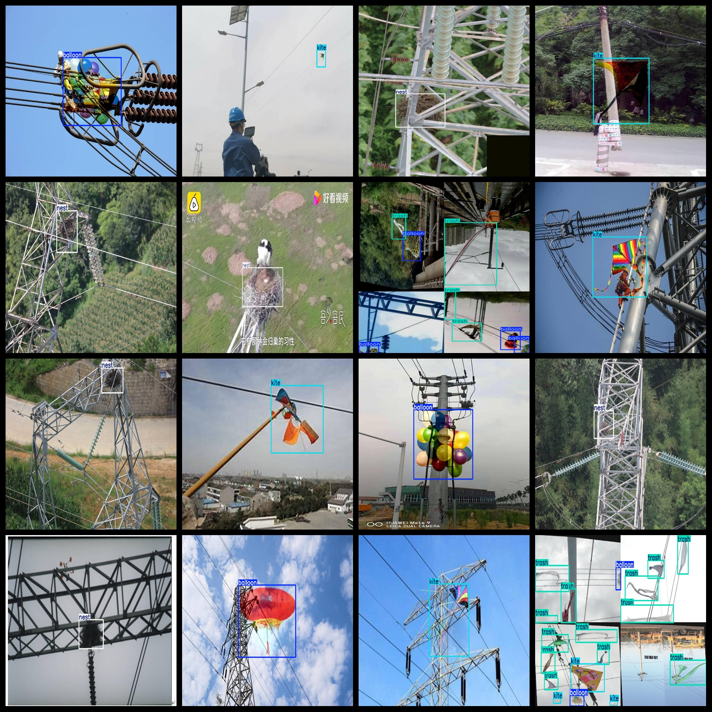
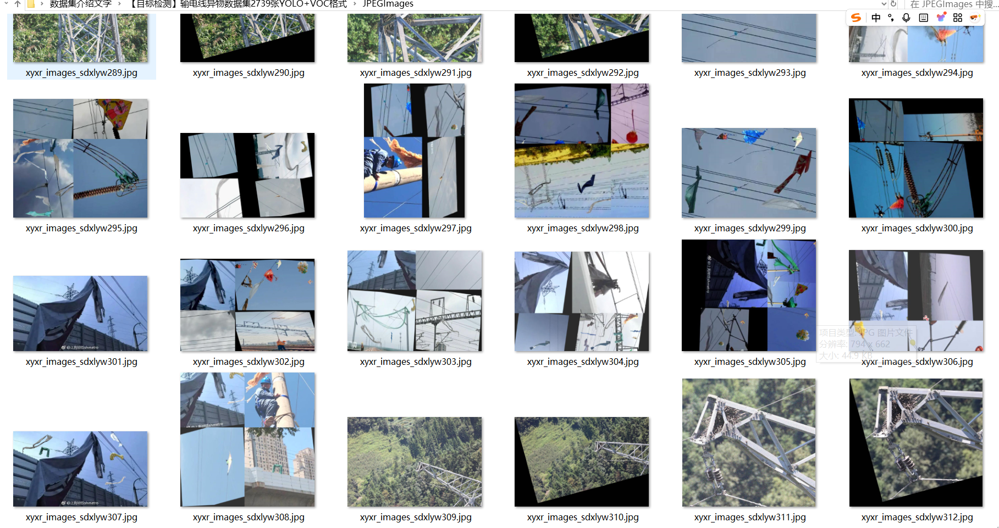

# [Object Detection] Transmission Line Foreign Object Dataset 2739 imagesYOLO+VOC format

【Target Detection】2739 Images of Outage in Power Wires with YOLO+VOC Format

The image collage is extensive, with some photoshopping involved. If you are sensitive to this, please do not take photos or consider contacting us before making a decision.

Dataset Format: VOC format + YOLO format

The compressed file contains: three folders, each storing images, xml files, and text files.

Total jpg images in JPEGImages folder: 2739

The total number of XML files in the Annotations folder is: 2739.

The total number of txt files in the labels folder is 2739.

Number of tag categories: 4

Tag names: ["balloon","kite","nest","trash"]

The number of boxes for each label (Note that the order of labels in the Yolo format does not correspond to this, but is based on the classes.txt file in the labels folder):

balloon frame count = 766

kite frame count = 935

nest frame count = 1480

trash frame count = 6036

Total boxes: 9217

Picture clarity (Resolution: Pixels): Clear

Image Enhancement: Yes

Shape of the label: Rectangular box, used for object detection and recognition.

Important Note: None

Special Notice: This dataset does not guarantee the accuracy or precision of the trained models or weight files. The dataset only provides accurate and reasonable annotations.

## Images

---

Here is a pay link on Stripe (https://buy.stripe.com/3cs8yP7sY87d0vu9AB). Please contact me lonlonago@foxmail.com after funding $89, and I will send you a complete data files, thank you!

